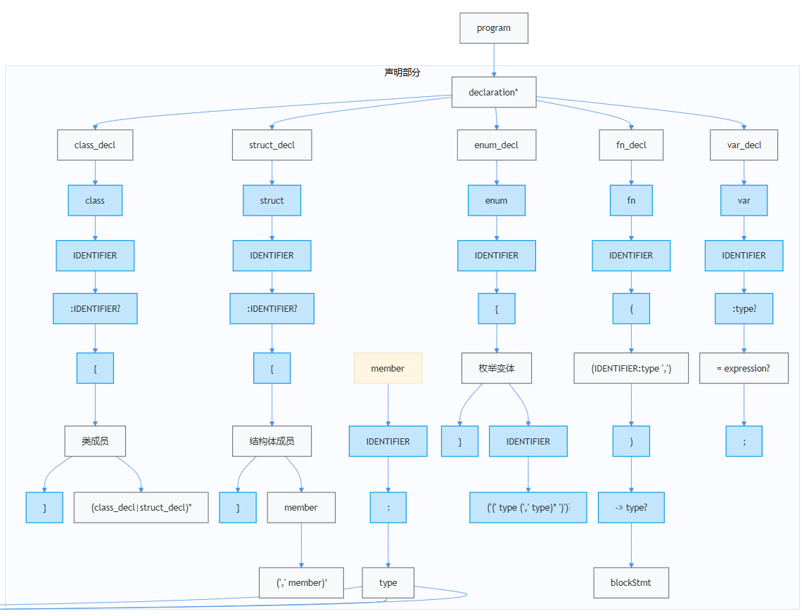
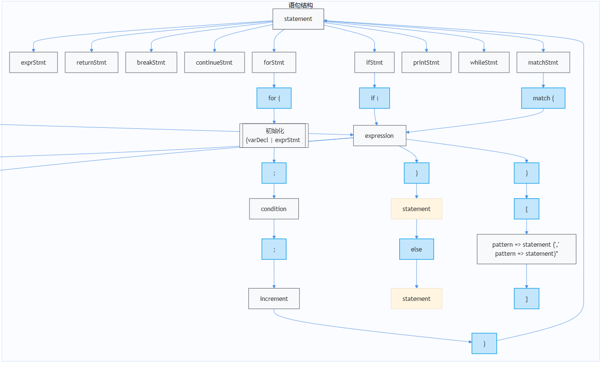
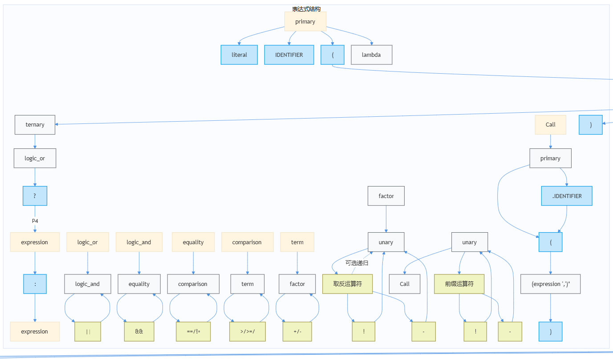
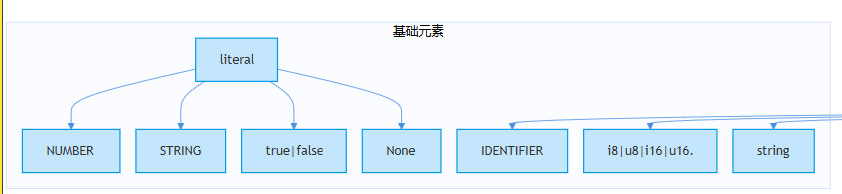
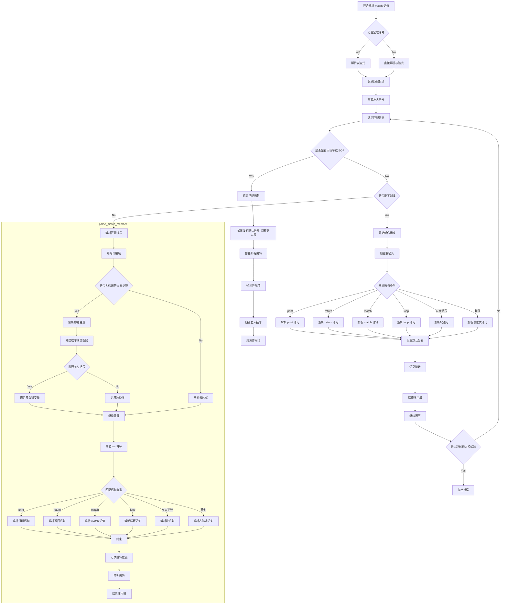

# 示例

## 上下文无关语法

上下文无关语法（Context-Free Grammar，CFG）是一种形式文法，广泛应用于编程语言、自然语言处理等领域。以下是关键点说明：

1. 基本定义
形式化表示为四元组：G = (N, Σ, P, S)
N：非终结符集合（如变量）
Σ：终结符集合（如具体符号）
P：产生式规则集合（形式为 V → w，其中 V ∈ N，w ∈ (N ∪ Σ)*）
S：起始符号（S ∈ N）

2. 核心特性
独立性：每个产生式仅依赖左侧的非终结符，不依赖上下文。
递归性：允许非终结符通过产生式递归定义自身（如 E → E + E）。

3. 示例与应用
编程语言语法：描述表达式、语句的嵌套结构。例如：

```buf
<expression> ::= <number> | <expression> "+" <expression>
             ->
```
4. 与二义性的关系
上下文无关语法可通过推导树或引入`优先级`规则消除二义性。例如，在算术表达式中定义 * 优先级高于 +。

```mermaid
%%{init: {
  'flowchart': {
    'curve': 'monotoneX',
    'nodeSpacing': 20,
    'rankSpacing': 40
  },
  'theme': 'base',
  'themeVariables': {
    'primaryColor': '#FFF5E1',
    'edgeLabelBackground':'#FFF',
    'lineColor': '#4a90e2'
  }
}}%%
graph TD
    classDef terminal fill:#c3e6fd,stroke:#039be5,stroke-width:1.5px;
    classDef nonterminal fill:#f8f9fa,stroke:#495057,dashed;
    classDef operator fill:#f0f4c3,stroke:#827717;

    %% ========== 程序结构 ==========
    program[program]:::nonterminal --> declarationA[declaration*]:::nonterminal
    
    subgraph 声明部分
    declarationA --> class_decl:::nonterminal
    declarationA --> struct_decl:::nonterminal
    declarationA --> enum_decl:::nonterminal
    declarationA --> fn_decl:::nonterminal
    declarationA --> var_decl:::nonterminal
    
    class_decl --> c1["class"]:::terminal --> c2[IDENTIFIER]:::terminal --> c3[":IDENTIFIER?"]:::terminal
    c3 --> c4["{"]:::terminal --> class_body["类成员"]:::nonterminal --> c5["}"]:::terminal
    class_body --> cb1["(class_decl|struct_decl)*"]:::nonterminal

    struct_decl --> s1["struct"]:::terminal --> s2[IDENTIFIER]:::terminal --> s3[":IDENTIFIER?"]:::terminal
    s3 --> s4["{"]:::terminal --> struct_body["结构体成员"]:::nonterminal --> s5["}"]:::terminal
    struct_body --> sm1["member"]:::nonterminal --> sm2["(',' member)*"]:::nonterminal

    member --> m1[IDENTIFIER]:::terminal --> m2[":"]:::terminal --> type:::nonterminal
    
    enum_decl --> e1["enum"]:::terminal --> e2[IDENTIFIER]:::terminal --> e3["{"]:::terminal
    e3 --> enum_body["枚举变体"]:::nonterminal --> e4["}"]:::terminal
    enum_body --> ev1["IDENTIFIER"]:::terminal --> ev2["('(' type (',' type)* ')')?"]:::terminal
    
    fn_decl --> f1["fn"]:::terminal --> f2[IDENTIFIER]:::terminal --> f3["("]:::terminal
    f3 --> params["(IDENTIFIER:type ',')*"]:::nonterminal --> f4[")"]:::terminal
    f4 --> return["-> type?"]:::terminal --> blockStmt:::nonterminal
    
    var_decl --> v1["var"]:::terminal --> v2[IDENTIFIER]:::terminal --> v3[":type?"]:::terminal
    v3 --> v4["= expression?"]:::nonterminal --> v5[";"]:::terminal
    end

    %% ========== 语句结构 ==========
    subgraph 语句结构
    statement:::nonterminal --> exprStmt:::nonterminal
    statement --> returnStmt:::nonterminal
    statement --> breakStmt:::nonterminal
    statement --> continueStmt:::nonterminal
    statement --> matchStmt:::nonterminal
    statement --> ifStmt:::nonterminal
    statement --> printStmt:::nonterminal
    statement --> whileStmt:::nonterminal
    statement --> forStmt:::nonterminal
    
    forStmt --> fs1["for ("]:::terminal --> fs2[["初始化
    (varDecl | exprStmt )"]]:::nonterminal
    fs2 --> fs3[";"]:::terminal --> condition:::nonterminal
    condition --> fs4[";"]:::terminal --> increment:::nonterminal
    increment --> fs5[")"]:::terminal --> statement
    
    ifStmt --> is1["if ("]:::terminal --> expression:::nonterminal --> is2[")"]:::terminal
    is2 --> stmt1[statement] --> else["else"]:::terminal
    else --> else_stmt[statement]
    
    matchStmt --> ms1["match ("]:::terminal --> expression --> ms2[")"]:::terminal
    ms2 --> ms3["{"]:::terminal --> pattern_case["pattern => statement (',' pattern => statement)*"]:::nonterminal
    pattern_case --> ms7["}"]:::terminal
    end

    %% ========== 表达式结构 ==========
    subgraph 表达式结构
    expression:::nonterminal --> ternary:::nonterminal
    ternary --> t1[logic_or]:::nonterminal --> t2["?"]:::terminal
    t2 -->|P4| yes[expression] --> t3[":"]:::terminal --> no[expression]

    logic_or --> lo1[logic_and]:::nonterminal --> lo2["||"]:::operator
    lo2 --> lo1

    logic_and --> la1[equality]:::nonterminal --> la2["&&"]:::operator
    la2 --> la1

    equality --> eq1[comparison]:::nonterminal --> eq2["==/!="]:::operator
    eq2 --> eq1

    comparison --> cp1[term]:::nonterminal --> cp2[">/>=/</<="]:::operator
    cp2 --> cp1

    term --> tm1[factor]:::nonterminal --> tm2["+/-"]:::operator
    tm2 --> tm1

    %% 修正后的 factor 结构
    factor:::nonterminal --> fa1[unary]:::nonterminal
    fa1 --> fa2["取反运算符"]:::operator
    fa2 -.->|可选递归| fa1
    fa2 --> fa3["\!"]:::operator
    fa3 --> fa1
    fa2 --> fa4["\-"]:::operator
    fa4 --> fa1

    %% 修正后的 unary 结构
    unary:::nonterminal --> u1["前缀运算符"]:::operator
    u1 --> u2["\!"]:::operator
    u2 --> unary
    u1 --> u3["\-"]:::operator
    u3 --> unary
    unary --> u4[Call]:::nonterminal

    Call --> ca1[primary]:::nonterminal --> ca2["("]:::terminal
    ca2 --> arguments["(expression ',')*"]:::nonterminal --> ca3[")"]:::terminal
    ca1 --> ca4[".IDENTIFIER"]:::terminal --> ca2

    primary --> pr1[literal]:::terminal
    primary --> pr2[IDENTIFIER]:::terminal
    primary --> pr3["("]:::terminal --> expression --> pr4[")"]:::terminal
    primary --> lambda:::nonterminal
    end

    %% ========== 基础元素 ==========
    subgraph 基础元素
    literal:::terminal --> NUMBER:::terminal
    literal --> STRING:::terminal
    literal --> bool["true|false"]:::terminal
    literal --> none["None"]:::terminal
    
    type --> tid[IDENTIFIER]:::terminal
    type --> numeric["i8|u8|i16|u16..."]:::terminal
    type --> string["string"]:::terminal
    end
```




### 声明



### 语句



### 表达式



### 基本元素




# parser

### parser


